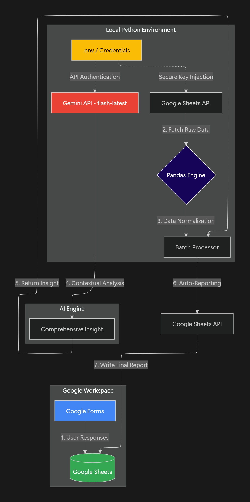

# 📋 survey-auto-summarizer

An AI-powered insight pipeline that automates Google Forms data analysis and reporting using Gemini AI and Google Sheets API.

## 🎯 Background & Motivation
- **The Context**
  - Following a large-scale International Exchange Program at the university, an extensive satisfaction survey was conducted. Due to the diverse background of the participants, the survey collected a vast amount of subjective feedback in multiple languages.

- **The Problem**
  1. Data Overload: Manually reading and summarizing hundreds of student reviews (minimum 100 characters each) required immense time and energy.

  2. Analysis Complexity: It was difficult for    humans to cross-analyze patterns based on nationality, gender, and participation status to find meaningful insights.

  3. Data Abandonment: Valuable feedback often remained scattered in spreadsheets, making it difficult to utilize as "lessons learned" for future program planning.

- **The Solution**
  1. Automated Pipeline: Built a system that loads real-time data from Google Sheets for immediate processing.

  2. AI Cross-Analysis: Leveraged Gemini AI to analyze cultural differences (e.g., language barriers for specific nationalities) and participation trends.

  3. Automated Feedback: Analysis reports are automatically written back to the source spreadsheet for stakeholder review.

- **Data Source**: Google Forms (Event participation status and post-activity feedback)

- **Key Columns**
  1. Timestamp
  2. Last Event Participation Status
  3. Name
  4. Gender
  5. Nationality
  6. Student ID
  7. **Feedback / Thoughts (Min. 100 chars)**
  8. **AI Analysis Results** (Aggregate Insights generated by Gemini AI)

- **Survey Auto-Summarizer Architecture (Mermaid)**
  

  
   
  <em>Survey Auto-Summarizer Architecture (Mermaid)</em>

##  🛠️ Technology Stack
- **Language**: Python 3.14.0

- **Data Handling**: Pandas(Normalization & Padding)

- **API Integration**: Google Sheets API v4

- **AI Engine**: Google Gemini 2.0 Flash (gemini-flash-latest)

- **Security**: python-dotenv, .gitignore (Environment Variable Management)

## ✅ Milestone
- **Phase 1**: Planning and building a Google cloud environment
  - [x] Phase 1-1: Determining Project Scope
  - [x] Phase 1-2: Google Cloud Console
  - [x] Phase 1-3: Create Service Account & credentials.json
  - [x] Phase 1-4: Configuring the Development Environment (.gitignore, venv)
  - [x] Phase 1-5: Confirmation of technology stack (requirements.txt)

- **Phase 2**: Implementing Google Sheet Data Pipeline
  - [x] Phase 2-1: API Interworking Test (Data Load)
  - [x] Phase 2-2: Pandas preprocessing logic (Data Normalization & Padding)
  - [x] Phase 2-3: Real-time data response (Filtering unprocessed rows)
  - [x] Phase 2-4: Error Handling (Try-Except, time.sleep)

- **Phase 3**: AI Summary Engine and Results Feedback(Next)
  - [x] Phase 3-1: Prompt Engineering
  - [x] Phase 3-2: Interworking with AI API
  - [x] Phase 3-3: Automatic recording of results
  - [x] Phase 3-4: Create Final README

## 📈 Results
- **Efficiency**: Reduced survey analysis and summary time by over 95% compared to manual labor.
- **Accuracy**: Successfully extracted nuanced insights based on nationality and gender, providing a data-driven foundation for future program planning.

## 🔥 Troubleshooting & Lessons Learned
**1. AI Model & Quota Management (404 & 429 Errors)**
  - **Challenge**: Encountered 404 errors due to deprecated model identifiers and 429 errors from free-tier quota limits.

  - **Resolution**: Debugged using genai.list_models() to identify stable identifiers and switched to gemini-flash-latest. Optimized API consumption by implementing batch processing instead of individual row calls.

**2. Security Incident Response (Secret Management)**
  - **Challenge**: Exposed API keys detected by GitHub Secret Scanning.

  - **Resolution**: Immediately revoked and rotated the exposed keys. Implemented a secure environment variable system using .env and cleaned git history to prevent future leaks.

**3. Data Normalization & Consistency**
  - **Challenge**: Inconsistent column counts due to empty cells in Google Sheets caused DataFrame construction errors.

  - **Resolution**: Implemented a data padding logic to ensure structural consistency across all input rows.

## 🧐 Self-Reflection
- **Technical Growth**
  - **System Integration**: Gained hands-on experience in architecting a data pipeline that bridges Google Workspace and Generative AI services.

  - **Security Mindset**: Developed a professional habit of "Security First" by managing sensitive credentials through environment variables.

- **Problem-Solving Mindset**
  - **User-Centric Development**: Realized that developers are not just "coders" but "problem solvers" who bridge the gap between human inconvenience and technical solutions.

- **Future Roadmap**
  - **UI/UX Improvement**: Plan to build a web interface using Streamlit or Flask for non-technical administrators.

  - **Real-time Triggers**: Integrating Google Apps Script (GAS) for true real-time automation triggered by form submissions.

## ✨ Connect with Me
- **GitHub Repository**: https://github.com/2daKaizen-gun/survey-auto-summarizer